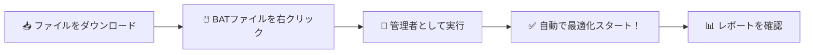
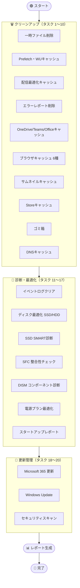
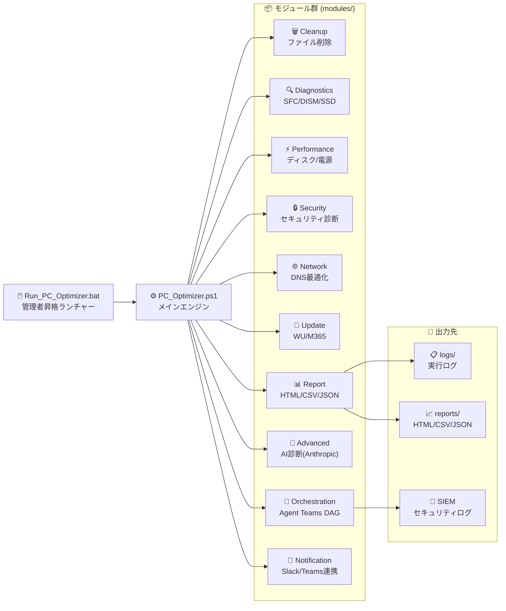
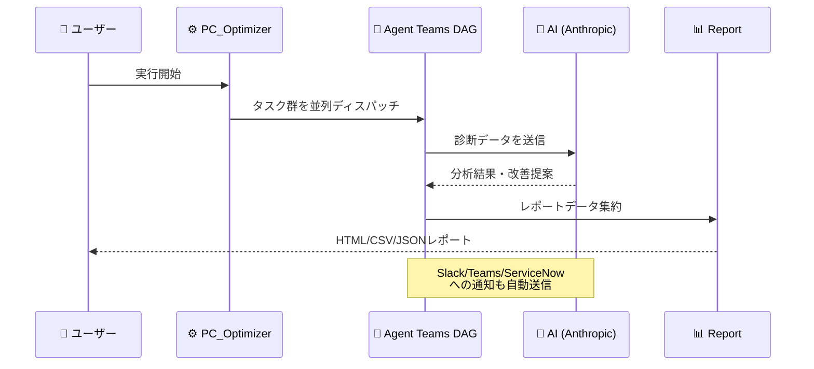

# 🖥️ PC Optimizer — Windows 自動最適化ツール

> **「ダブルクリックするだけで PC が速くなる」** — エンジニアでも非エンジニアでも使える、Windows 向け全自動メンテナンスツールです。

[](https://github.com/Kensan196948G/PC_Optimizer/actions/workflows/ci.yml)
[](https://github.com/PowerShell/PowerShell)
[](https://www.microsoft.com/windows)
[](LICENSE)

---

## 🎯 このツールでできること

PC が重い・遅い・容量が足りない、そんな悩みを **ワンクリックで解決** します。

| 🗑️ クリーンアップ | 🔧 診断・修復 | 🔄 更新管理 | 📊 レポート生成 |
|---|---|---|---|
| 一時ファイル削除 | SFC システム修復 | Windows Update | HTML グラフ |
| ブラウザキャッシュ | DISM 診断 | Microsoft 365 更新 | CSV/JSON 出力 |
| ゴミ箱の空化 | SSD SMART 診断 | セキュリティ更新 | スコア履歴 |
| DNS キャッシュクリア | ディスク最適化 | ドライバー確認 | AI 分析レポート |

---

## 🚀 使い方（3ステップ）



### 手順詳細

1. **📥 ダウンロード** — `PC_Optimizer.ps1` と `Run_PC_Optimizer.bat` を同じフォルダへ
2. **🖱️ 右クリック** — `Run_PC_Optimizer.bat` を右クリック
3. **👑 管理者実行** — 「管理者として実行」を選択 → UAC で「はい」

完了後、レポートが `reports/` フォルダに自動保存されます。

### GUI / CUI の両対応

- `Run_PC_Optimizer.bat` : 従来どおりの CUI 起動
- `Run_PC_Optimizer_GUI.bat` : WPF GUI 起動
- `gui/PCOptimizer.Gui.ps1` : GUI 本体

GUI は内部で既存の `PC_Optimizer.ps1` を呼び出すため、CLI と実行エンジンは共通です。

### GUI でできること

- 20 個の最適化タスクを GUI 上で個別選択して実行
- `repair` / `diagnose`、`classic` / `agent-teams`、`continue` / `fail-fast` を画面から切替
- `WhatIf` プレビュー、AI 診断有効化、設定ファイルパス指定に対応
- 実行ログ、進捗、状態、最新 HTML レポートパスをリアルタイム表示
- `ログを開く` / `レポートを開く` ボタンから生成物へ直接アクセス

### GUI 起動方法

1. `Run_PC_Optimizer_GUI.bat` を右クリック
2. 「管理者として実行」を選択
3. GUI 上でタスクとオプションを選び、`実行` を押下

PowerShell 5.1 以上があれば GUI を利用できます。通常利用のために `dotnet` や `MSBuild` の事前インストールは不要です。

---

## 🔄 実行される 20 タスク



---

## 🏗️ システム構成図



---

## 🤖 Agent Teams — AI オーケストレーション

v4.0 から **AI エージェントチーム** が自律的に診断・修復・レポートを行います。



---

## 📊 対応環境

| 項目 | 要件 |
|:---:|---|
| 💻 OS | Windows 10 / 11 |
| ⚡ PowerShell | 5.1 以上（7.x 推奨） |
| 🪟 GUI | WPF 利用可能な Windows 環境 |
| 👑 権限 | 管理者権限必須 |
| 🌐 ネットワーク | 任意（オフライン動作対応） |
| 🤖 AI 機能 | Anthropic API キー（オプション） |

---

## 📁 ファイル構成

```
📁 PC_Optimizer/
├── 🖱️ Run_PC_Optimizer.bat   ← ここをダブルクリック！
├── 🪟 Run_PC_Optimizer_GUI.bat GUI ランチャー
├── ⚙️ PC_Optimizer.ps1        メインスクリプト
├── 🪟 gui/                    WPF GUI
├── 📦 modules/                機能モジュール群
│   ├── Common.psm1            共通ユーティリティ
│   ├── Cleanup.psm1           クリーンアップ
│   ├── Diagnostics.psm1       診断
│   ├── Performance.psm1       パフォーマンス最適化
│   ├── Security.psm1          セキュリティ
│   ├── Network.psm1           ネットワーク
│   ├── Update.psm1            更新管理
│   ├── Report.psm1            レポート生成
│   ├── Advanced.psm1          AI 診断
│   ├── Orchestration.psm1     エージェント制御
│   └── Notification.psm1      通知連携
├── ⚙️ config/                 設定ファイル
├── 📊 reports/                レポート出力（自動生成）
├── 📋 logs/                   実行ログ（自動生成）
└── 🧪 tests/                  テストスクリプト
```

---

## 🧪 品質・テスト状況

| テストスイート | 件数 | 状態 |
|---|:---:|:---:|
| 機能テスト（Test_PCOptimizer.ps1） | 93件 | ✅ PASS |
| Pester テスト（PCOptimizer.Pester） | 50件 | ✅ PASS |
| GUI 統合テスト（Test_GUIIntegration.ps1） | 18件 | ✅ PASS |
| CLI 回帰テスト（Test_CLIModes.ps1） | 22件 | ✅ PASS |
| タスク入力検証（Test_TasksValidation.ps1） | 17件 | ✅ PASS |
| Agent Teams E2E テスト | 複数 | ✅ PASS |
| Agent Teams 負荷テスト | 複数 | ✅ PASS |
| スモークテスト（PS5.1 / PS7） | 複数 | ✅ PASS |

---

## 📚 ドキュメント一覧

| ドキュメント | 内容 |
|---|---|
| 📖 [詳細 README](docs/README.md) | 全機能の詳細説明 |
| 🚀 [インストール手順](docs/インストール手順.md) | セットアップ方法 |
| 📋 [使い方](docs/使い方.md) | 詳細な操作方法 |
| 🏗️ [アーキテクチャ](docs/アーキテクチャ.md) | システム設計図 |
| 🔧 [トラブルシューティング](docs/トラブルシューティング.md) | 困ったときは |
| 🔒 [セキュリティ](docs/セキュリティ.md) | セキュリティ考慮事項 |
| 📝 [変更履歴](docs/変更履歴.md) | バージョン履歴 |
| ⚙️ [config 仕様](docs/config仕様.md) | 設定ファイル仕様 |
| 📊 [ログ仕様](docs/ログ仕様.md) | ログファイル仕様 |
| 🤖 [エージェント開発ガイド](docs/エージェント開発ガイド.md) | AI エージェント開発 |
| 🗃️ [リポジトリ運用方針](docs/リポジトリ運用方針.md) | Git/CI 運用ルール |

---

## 🔔 外部連携（オプション）

以下の外部サービスと連携できます（デフォルト無効）。

| サービス | 用途 | 設定 |
|---|---|---|
| 🤖 Anthropic API | AI 診断・改善提案 | `config/config.json` |
| 💬 Slack | 実行結果通知 | `config/config.json` |
| 📧 Microsoft Teams | 実行結果通知 | `config/config.json` |
| 🎫 ServiceNow | インシデント自動起票 | `config/config.json` |
| 📌 Jira | チケット自動生成 | `config/config.json` |
| 🔐 SIEM | セキュリティログ連携 | `config/config.json` |

---

## ⚠️ 注意事項

- 必ず **管理者権限** で実行してください
- 実行中は PC の操作を最小限にしてください
- 初回実行前に重要なデータのバックアップを推奨します
- `modules/Notification.psm1` の外部通知はデフォルト無効です

---

## 📜 ライセンス

MIT License — 個人・法人を問わず無料でご利用いただけます。

---

<div align="center">

**🖥️ PC Optimizer** — *あなたの PC を、もっと速く。*

[🐛 バグ報告](https://github.com/Kensan196948G/PC_Optimizer/issues) | [💡 機能要望](https://github.com/Kensan196948G/PC_Optimizer/issues) | [📖 詳細ドキュメント](docs/README.md)

</div>
